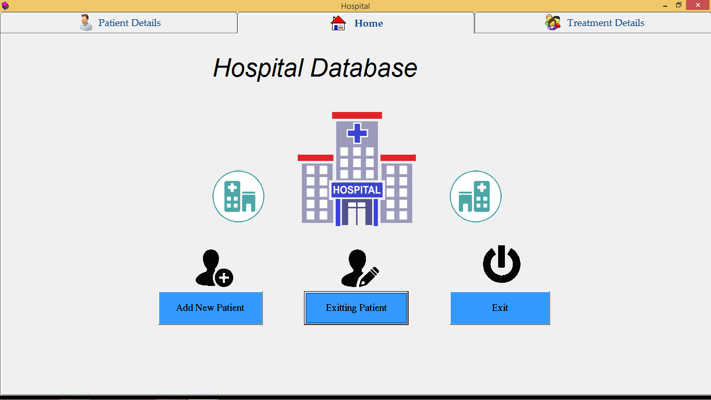
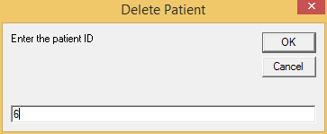
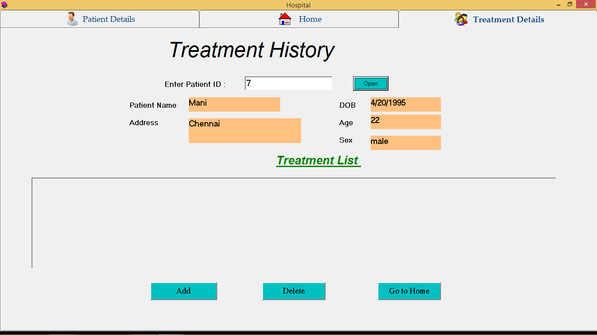
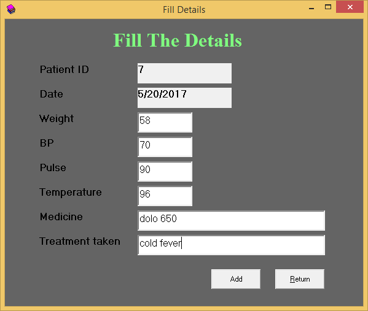

# Hospital Management System

## My Blog
>[https://manimaran96.wordpress.com](https://manimaran96.wordpress.com) 

## Project Abstract

1. Hospital management system fully designed by using Visual Basic.
2. Store all details in data base.
3. New patient details regiter also.
4. Existing patient are check and view medicine details.
5. All reports are maintained in database
6. Easily add,remove patient details.

## How to use
1. Install visual basic
2. Open hospital.vbp file

## Screenshots
### 1. Home - Screen
Home screen is the first interface. Which have options to add new patient, exitting patient and exit button. If patient alredy taken checkup they use exitting patient button. otherwise use add new patient.if close the window use exit.

### 2. Add New Patient - Screen
Add new patient screen use add new patient details like name,age,dob,address and some extra details.

### 3. View Patient list - Screen
That the window use to show all the checkup patient details.

### 4. Delete Patient - Screen
Delete patient option use to delete the particular patient with using patient id.

### 5. Full Details Info of Exitting Patient - Screen
This screen to use display the particular patient treatment details history. Which have get the patient id and then display the information of name, age, address, treatment date, tablets and some information. Which use to next time of checkup to consider the doctor.

### 6. Add Treatment details - Screen
Add the what are the treatment taken patient from the doctor.which like that patient id,date of checkup, weight, BP, pulse, temperature, medicine to taken and what the treatment taken for patient.

## **About me**
        Manimaran.K
        Computer Science Engineering
        manimaraninam1027@gmail.com
        Facebook - https://www.facebook.com/manimaran.cse.1
        Twitter - https://twitter.com/Manimaran_lpt
